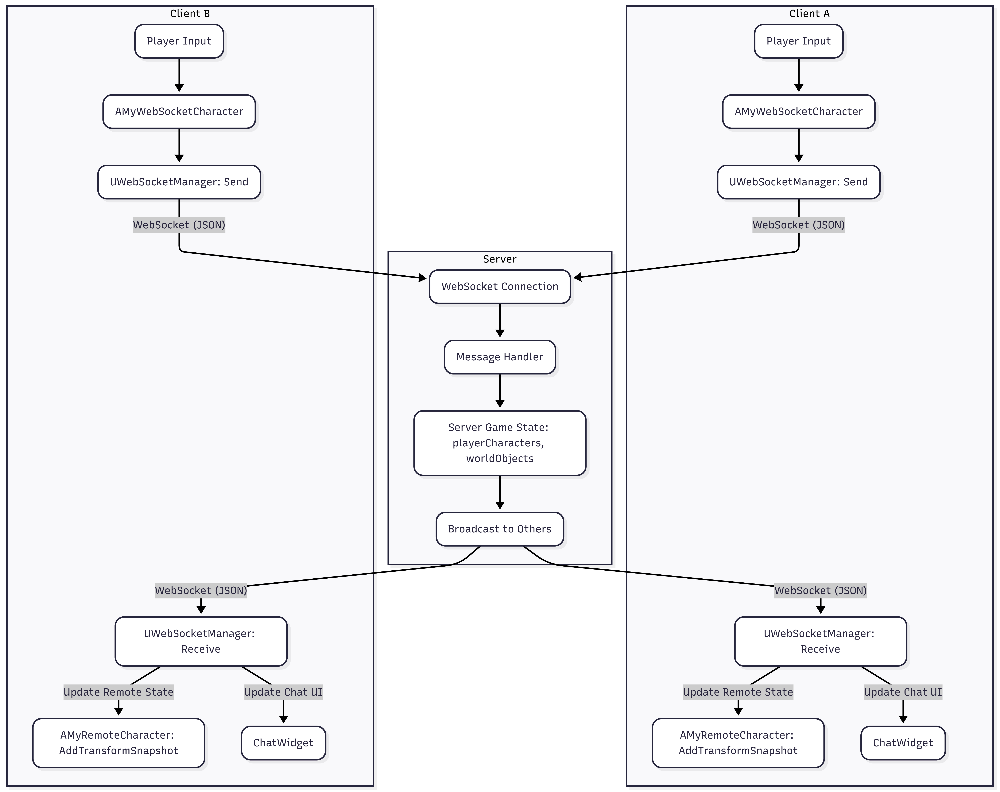

# Unreal 5 & WebSocket 기반 커스텀 멀티플레이어 프로젝트

언리얼 엔진 5의 기본 멀티플레이 기능을 활용하는 대신, 학과에서 학습한 컴퓨터 과학(CS) 지식을 기반으로 직접 커스텀 네트워크 시스템을 구축하고 적용하는 것을 목표로 한 3D 멀티플레이어 프로젝트.

 

## 🚀 개발 동기 및 주요 이점 (Motivation & Key Advantages)

이 프로젝트는 언리얼 엔진의 강력한 기능에 의존하기보다, 직접 컴퓨터 과학(CS) 이론을 적용하여 멀티플레이어 시스템을 구현함으로써 다음과 같은 장점과 학습 경험을 얻는 것을 목표로 함.

*   **네트워크 원리 심화 학습**: TCP/IP, WebSocket 프로토콜, 데이터 직렬화/역직렬화, 비동기 통신 등 네트워크 통신의 근본 원리를 깊이 있게 이해하고 실제 적용할 수 있었음.
*   **유연한 시스템 설계**: 언리얼 엔진의 기본 레플리케이션 시스템에 얽매이지 않고, 프로젝트의 특성과 요구사항에 맞춰 최적화된 네트워크 구조와 데이터 동기화 방식을 자유롭게 설계하고 구현할 수 있었음.
*   **문제 해결 능력 강화**: 지연(Latency), 패킷 손실, 데이터 일관성 유지 등 실제 멀티플레이어 환경에서 발생할 수 있는 다양한 기술적 문제들을 직접 분석하고 해결하는 과정을 통해 문제 해결 능력을 크게 향상시킴.
*   **엔진 독립적인 백엔드 구성**: Node.js 기반의 서버는 언리얼 엔진에 종속되지 않아, 향후 다양한 클라이언트(웹, 모바일 등)와의 연동 가능성을 열어두는 확장성 높은 아키텍처를 경험할 수 있었음.

 

### 📝 로그인 (Login)

### 🤝 실시간 동기화 (Real-time Synchronization)

### 💬 채팅 (Chat)

### 📦 오브젝트 동기화 (Object Synchronization)

 

## 📐 아키텍처 (Architecture)

 

## ✨ 주요 기능 (Features)

-   **실시간 움직임 동기화**: 한 클라이언트의 이동, 점프 등 움직임이 다른 클라이언트에 실시간으로 반영.
-   **클라이언트 측 보간(Interpolation)**: 서버로부터 받은 위치값으로 부드럽게 이동하여 끊김 없는 움직임을 구현.
-   **월드 오브젝트 동기화**: 월드 내 배치된 특정 오브젝트의 상태를 모든 클라이언트가 공유.
-   **실시간 채팅**: 모든 플레이어가 참여할 수 있는 전체 채팅 기능을 구현.
-   **커스텀 서버**: Node.js `ws` 모듈 기반의 경량화된 서버를 통해 클라이언트들을 중계.

 

## 💻 클라이언트 API (Client API)

`WebSocketManager` 클래스를 통해 서버로 전송되는 주요 메시지 명세.

| 함수명 | 설명 | 주요 파라미터 |
| :--- | :--- | :--- |
| `Connect(InUsername)` | WebSocket 서버에 연결을 시도하고 플레이어 이름을 등록 | `FString InUsername` |
| `SendRegisterCharacter()` | 서버에 현재 캐릭터의 생성을 요청 | 없음 |
| `SendUpdate(...)` | 플레이어 또는 오브젝트의 상태(위치, 속도 등)를 서버로 전송 | `EntityType`, `ID`, `Transform`, `Speed`, `bIsFalling` |
| `SendChatMessage(Message)` | 채팅 메시지를 서버로 전송 | `FString Message` |
| `SendWorldObjectTransform(...)` | 특정 월드 오브젝트의 Transform을 서버로 전송 | `FString ObjectID`, `FTransform Transform` |

 

## 📡 서버 API (Server API)

서버가 클라이언트로 브로드캐스팅하는 주요 메시지 명세.

| 메시지 타입 | 액션 | 설명 | 주요 데이터 |
| :--- | :--- | :--- | :--- |
| `state_sync` | - | 최초 접속 시 현재 월드의 모든 플레이어와 오브젝트 상태를 동기화 | `worldObjects`, `playerCharacters` |
| `id` | - | 접속한 클라이언트에게 고유 플레이어 ID를 부여 | `id` |
| `render_update` | `add_character` | 새로운 플레이어가 월드에 추가되었음을 알림 | `playerID`, `state` |
| `render_update` | `remove_character` | 플레이어가 월드에서 떠났음을 알림 | `playerID` |
| `render_update` | `update` | 특정 플레이어 또는 오브젝트의 상태가 갱신되었음을 알림 | `id`, `state` |
| `render_update` | `new_chat` | 새로운 채팅 메시지가 도착했음을 알림 | `playerID`, `message` |

 

## 🛠️ 기술 스택 (Tech Stack)

-   **Client**: `Unreal Engine 5`, `C++`
-   **Server**: `Node.js`
-   **Network**: `WebSocket`
-   **Data Format**: `JSON`

 

## 🤔 기술적 문제 해결 사례

#### 1. 플레이어 캐릭터의 움직임 끊김 현상 (정확도 중심 해결)

*   **문제**
    네트워크 지연으로 인해 다른 플레이어의 캐릭터가 순간이동하듯 뚝뚝 끊겨 보이는 현상이 발생. 플레이어 간의 상호작용이 핵심인 게임에서 이는 사용자 경험에 치명적인 문제였음.

*   **해결**
    플레이어 움직임의 **정확성**을 최우선으로 고려하여, **타임스탬프 기반의 스냅샷 보간(Snapshot Interpolation) 기법**을 도입. 서버로부터 타임스탬프가 포함된 위치 데이터(스냅샷)들을 수신하여 버퍼에 저장하고, 현재 클라이언트 시간에 맞춰 두 스냅샷 사이의 정확한 위치를 계산하여 캐릭터를 부드럽게 이동시키는 로직(`AddTransformSnapshot` 활용)을 구현함.

*   **결과**
    네트워크 지연이나 패킷 순서 변동에도 플레이어의 움직임을 매우 정확하고 부드럽게 예측 및 표현할 수 있게 됨. 이를 통해 사용자는 쾌적한 멀티플레이 경험을 할 수 있게 되었고, 향후 서버 리컨실리에이션(Server Reconciliation) 같은 고급 기법을 도입할 수 있는 기술적 기반을 마련함.

#### 2. 다수 오브젝트 동기화의 성능 저하 문제 (효율성 중심 해결)

*   **문제**
    맵에 배치된 다수의 월드 오브젝트(상자 등)들도 동기화가 필요했지만, 모든 오브젝트에 캐릭터와 동일한 고비용 스냅샷 보간 기법을 적용할 경우, 클라이언트의 연산량이 크게 증가하여 성능 저하가 우려되었음.

*   **해결**
    캐릭터에 비해 움직임의 정확도 중요도가 비교적 낮은 오브젝트의 특성을 고려하여, **단순하고 효율적인 선형 보간(Linear Interpolation) 기법**을 선택적으로 적용. 가장 최근에 수신한 목표 위치로만 부드럽게 이동시키는 `FMath::VInterpTo` 함수를 사용하여, 최소한의 연산으로 다수의 오브젝트를 동기화함.

*   **결과**
    각 동기화 대상의 중요도에 따라 다른 보간 전략을 적용함으로써, **시스템의 복잡도와 클라이언트 연산 부하를 최적화**함. 다수의 동기화 오브젝트가 배치된 환경에서도 성능 저하 없이 안정적인 멀티플레이 환경을 유지할 수 있게 됨.

#### 3. 불필요한 네트워크 트래픽 과다 발생

*   **문제**
    움직임이 없어도 매 프레임 위치 데이터를 서버로 전송하여, 소수 클라이언트만으로도 불필요한 네트워크 부하가 과도하게 발생함.

*   **해결**
    마지막으로 전송했던 상태와 현재 상태를 비교하여, **캐릭터의 위치나 상태에 의미 있는 변화가 있을 때만** 데이터를 전송하도록 최적화 로직을 추가. 이를 통해 불필요한 데이터 전송을 원천적으로 차단함.

*   **결과**
    네트워크 트래픽을 크게 감소시켜 서버의 처리 부담을 줄였고, 더 많은 동시 접속자를 수용할 수 있는 안정적이고 확장성 있는 기반을 마련함.

#### 4. 유지보수를 어렵게 만드는 복잡한 코드 구조

*   **문제**
    하나의 클래스(`AMyWebSocketCharacter`)가 너무 많은 기능(네트워크, UI, 플레이어 로직 등)을 담당하여, 기능 수정 시 연관 없는 부분에서 버그가 발생하는 등 유지보수가 매우 어려웠음.

*   **해결**
    **단일 책임 원칙(SRP)**에 따라 대대적인 리팩토링을 진행. 네트워크 통신은 `UWebSocketManager`로, 게임 전반의 생명주기 관리는 `GameInstance`로 역할을 완벽히 분리하여 클래스 간의 의존성을 낮춤.

*   **결과**
    코드의 구조가 명확해지고 역할이 분리되어 버그 발생률이 감소했으며, 새로운 기능(예: 오브젝트 동기화)을 더 빠르고 안정적으로 추가할 수 있는 유연한 아키텍처를 확보함.

#### 5. 게임 접속 시 다른 플레이어가 보이지 않는 문제

*   **문제**
    새로운 플레이어가 게임에 접속했을 때, 이미 월드에 있던 다른 플레이어들이 보이지 않고, 그들이 움직여야만 비로소 나타나는 동기화 누락 문제가 발생함.

*   **해결**
    **초기 상태 동기화(Initial State Sync) 로직**을 구축. 클라이언트가 접속을 완료하는 시점에, 서버가 현재 월드에 있는 모든 플레이어의 정보를 모아 단일 패킷(`state_sync`)으로 전송해주고, 클라이언트는 이 데이터를 기반으로 모든 캐릭터를 즉시 생성하도록 구현함.

*   **결과**
    플레이어는 접속과 동시에 월드의 모든 정보를 지연 없이 수신하게 되어, 언제 접속하든 일관된 게임 월드를 경험할 수 있게 됨.

## ⚠️ 참고 사항 (Notes)

핵심적인 C++ 코드와 네트워크 로직 확인에 중점을 두는 것이 목표이기에, 본 프로젝트의 `Content` 폴더(모델, 텍스처, 레벨 블루프린트 등)는 용량 문제로 인해 저장소에 포함되지 않음. 따라서, 프로젝트를 클론하여 실행할 경우 일부 에셋이 누락되거나 정상적인 시각적/기능적 경험이 어려울 수 있음. 